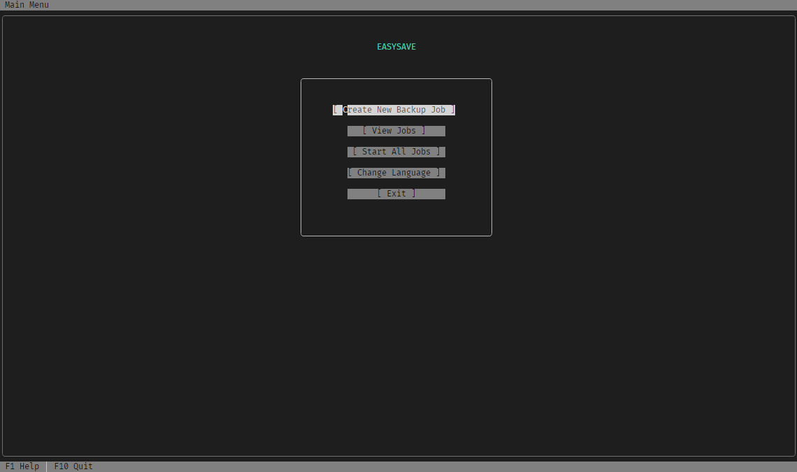
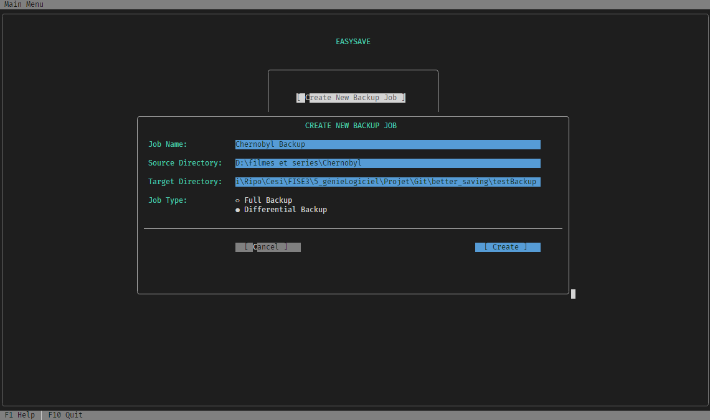
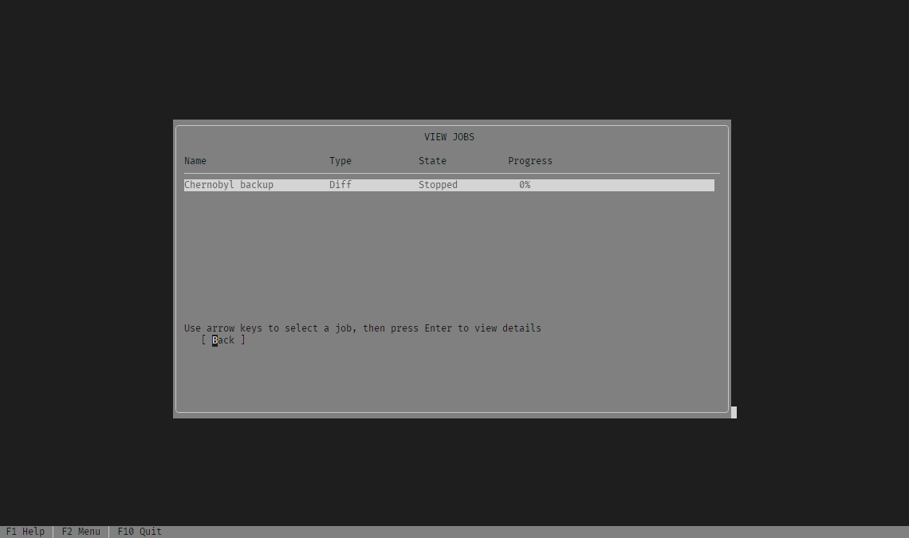
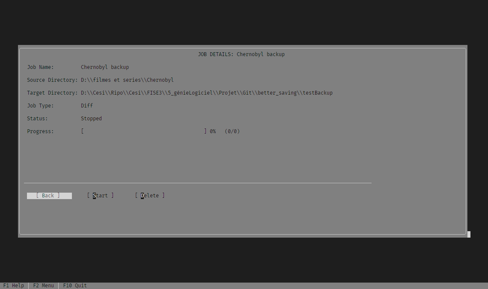
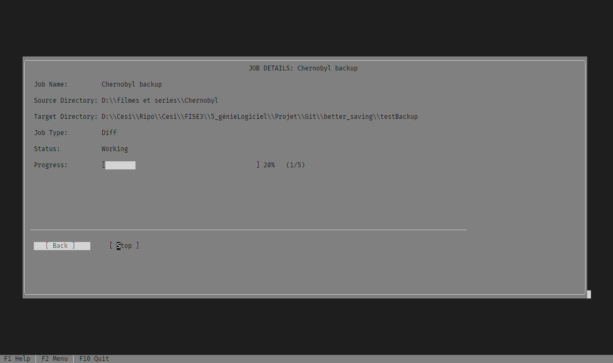
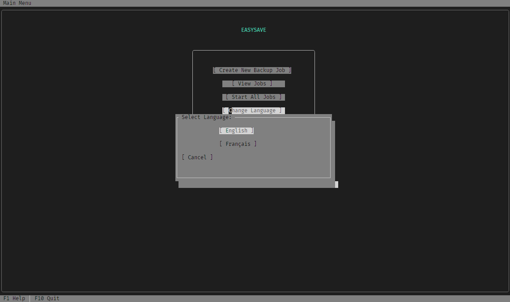
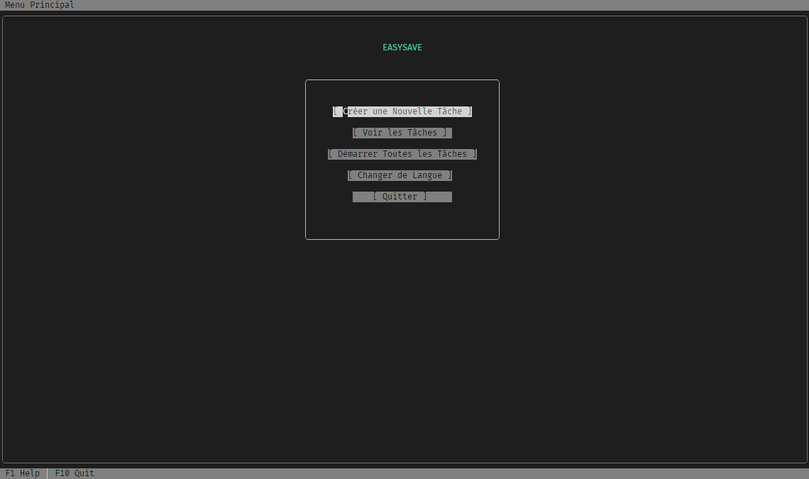

# EasySave

A robust C# file backup application with a Terminal GUI interface for efficiently managing backup jobs.

## Features

- **Multiple Backup Types**: Support for full and differential backups
- **Job Management**: Create, start, stop, and monitor backup jobs
- **Interactive Terminal GUI**: User-friendly interface built with Terminal.Gui
- **Progress Tracking**: Real-time tracking of backup progress
- **Logging System**: Comprehensive logging of backup activities and states
- **Multi-language Support**: Support for multiple languages in the interface
- **File Verification**: Uses XXHash64 algorithm for efficient file comparison

## Getting Started

### Prerequisites

- .NET 8.0 SDK or later
- Windows operating system

### Installation

1. Clone the repository:
   ```
   git clone https://github.com/Nayxooo/better_saving.git
   ```

2. Navigate to the project directory:
   ```
   cd better_saving
   ```

3. Build the application:
   ```
   dotnet build
   ```

4. Run the application:
   ```
   dotnet run
   ```

## Usage

1. Launch the application
2. Create a new backup job by specifying:
   - Job name
   - Source directory (files to backup)
   - Target directory (backup destination)
   - Backup type (Full or Differential)
3. Start the job to begin the backup process
4. Monitor the progress through the Terminal GUI
5. View logs for detailed information about backup operations

## Interface Screenshots

Below are screenshots of the EasySave console interface:

### Main Dashboard
*The main application interface showing job list and available actions*


### Job Creation
*Interface for creating a new backup job*


### Jobs List
*View of completed backup jobs and their results*


### Job Details
*Detailed view of a specific backup job, including progress and status*


### Backup Execution
*A backup job in progress with real-time statistics*


### Language Selection
*Application settings including language selection*


### Main Dashboard in French
*The main application interface in French*


## Project Structure

- **Controllers/**: Contains the main application controller
- **Models/**: Contains data models for backup jobs, file hashing, and logging
- **Views/**: Contains the Terminal.Gui-based user interface
- **UMLs/**: Contains UML diagrams describing the application architecture

## Documentation

For a comprehensive overview of the codebase, including detailed explanations of architecture, components, and implementation details, please see the [Code Overview](https://github.com/Nayxooo/better_saving/blob/develop/CODE_OVERVIEW.md) document.

## Acknowledgments

- [Terminal.Gui](https://github.com/migueldeicaza/gui.cs) - GUI toolkit used for the terminal interface
