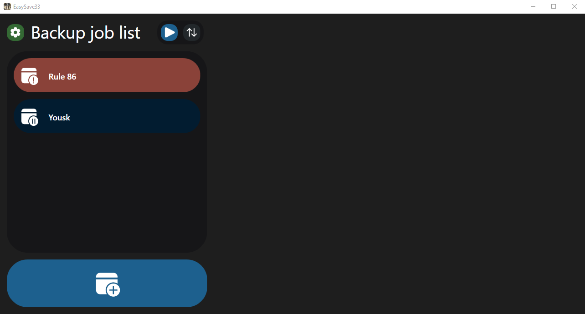

# EasySave

A robust C# file backup application with a modern WPF GUI interface for efficiently managing backup jobs.

## Changelog

For a detailed list of changes, new features, and bug fixes in each version, please see the [CHANGELOG.md](CHANGELOG.md) file.

## Features

- **Multiple Backup Types**: Support for full and differential backups.
- **Remote Job Management (TCP Server)**: Monitor and control backup jobs remotely via TCP (start, stop, pause, resume).
- **Global Transfer Throttling**: Limit total concurrent file transfer size across all backup jobs to manage bandwidth and system resources.
- **Real-time Progress Tracking**: Visual progress bars and status indicators.
- **Comprehensive Logging**: Detailed logging of backup activities, states, and critical errors to daily structured text logs and a dedicated `EasySave33_bugReport.log`.
- **Multi-language Support**: Support for English and French languages.
- **File Verification**: Uses XXHash64 algorithm for efficient file comparison.
- **Blocked Software Detection**: Prevents backups when specified software is running.
- **File Encryption**: Automatic encryption of specified file types using CryptoSoft (automatically downloaded if not present).
- **Priority File Extensions**: Backup files with specific extensions first.
- **Continuous Backup**: Automatic monitoring and backup of changes.

## UI

Below are some screenshots showcasing the application's user interface:

**Main Dashboard - Job List View:**

*Caption: Overview of all backup jobs with their status and progress.*

**Create New Backup Job:**

*Caption: Dialog for creating a new backup job, specifying name, source, destination, and type.*

**Job Details and Progress:**

*Caption: Detailed view of a running backup job, showing progress, files remaining, and total size.*

**Settings:**

*Caption: Application settings for language selection and general configurations.*

## Getting Started

### Prerequisites

- .NET 8.0 SDK or later
- Windows operating system
- WPF support

### Installation

1. Clone the repository:
   ```bash
   git clone https://github.com/Nayxooo/better_saving.git
   ```

2. Navigate to the project directory:
   ```bash
   cd better_saving
   ```

3. Build the application:
   ```bash
   dotnet build
   ```

4. Run the application:
   ```bash
   dotnet run --project better_saving.csproj
   ```

### Download Pre-built Executable

For convenience, a pre-built `.exe` file is available in the [Releases section](https://github.com/Nayxooo/better_saving/releases). Simply download the latest release and run it directly without needing to build from source.

### Building a Single Executable

To build the application into a single `.exe` file:
```bash
dotnet publish better_saving.csproj -c Release -r win-x64 -p:PublishSingleFile=true -p:IncludeNativeLibrariesForSelfExtract=true --self-contained true -o "publish"
```

## Usage

1. **Launch the application.**
2. **Create a new backup job** by clicking the "+" button and specifying:
   - Job name
   - Source directory
   - Destination directory
   - Backup type (Full or Differential)
3. **Configure settings** (optional) via the settings view:
   - Set blocked software that should prevent backups.
   - Specify file extensions to encrypt during backups.
   - Specify file extensions to prioritize during backups.
   - Enable or disable the TCP server for remote management.
   - Choose your preferred language (English or French).
4. **Start backup jobs** individually or all at once.
   - Play button to start/resume a job.
   - Pause button to pause a job (will resume to where it left off).
   - Stop button to stop a job (will restart from the beginning).